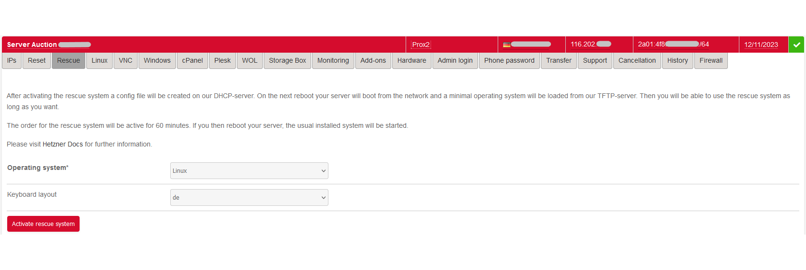

<p align="center">
	<a href="https://www.hetzner.com/"></a>
    <br>
	<a href="https://www.proxmox.com"></a>
    <br>
	<a href="https://www.pfsense.org/"></a>


```
    <br><br>
	
	<a href="https://hub.docker.com/repository/docker/jc21/nginx-proxy-manager">
		
	</a>
	<a href="https://hub.docker.com/repository/docker/jc21/nginx-proxy-manager">
		
	</a>
	<a href="https://gitter.im/nginx-proxy-manager/community">
		
	</a>
	<a href="https://reddit.com/r/nginxproxymanager">
		
	</a>
```
</p>

# Project Goal
This project shall help everyone who is seeking a good solution and guideline to setup Proxmox into a Hetzner root or bare metal server. Also a setup with pfSense will be described. All settings will be done with an focus to security and to have a solid solution.
In the world wide web exisiting many solutions and guidelines, but they are most outdated.

<p align="center">
	<a href="https://www.buymeacoffee.com/3xpl0ith4cr" target="_blank"></a>
</p>

## Scope
### Hetzner
- Setup from the scratch and setup through rescue mode
- Setup proxmox with help of scripts from <a href="https://github.com/CasCas2/proxmox-hetzner">https://github.com/CasCas2/proxmox-hetzner</a>
- Secure your base Proxmox setup
- Network Interface configuration for 1 IP address and IPv4

### Proxmox
- 
- 
- 

### pfSense
- 
- 


Let's start
# Hetzner setup
### Part 1
Log in into your Hetzner account and switch over to the **robot**


Goto the chapter **server**


and select your server. Afterwards you can go directly to your rescue tab.



Select Linux as the Operating System and click on **Activate rescue system**
For further details of the capabilities of the Hetzner Robot and Rescue System please follow the documentation from Hetzner. [https://docs.hetzner.com/robot]

==Please use for all passwords an password manager==

After the activation of the rescue system you have 60 minutes to reboot your server.
Before you do this safe the shown credentials into your password manager.
E.g.: [https://vault.bitwarden.com/#/login](https://vault.bitwarden.com/#/login) or self-hosted alternative [https://github.com/vineethmn/vaultwarden-docker-compose](https://github.com/vineethmn/vaultwarden-docker-compose)
You will receive the user name ==root== and the new ==password== only working for the rescue system.

Switch to the tab ==Reset== and selecte the **Execute an automatic hardware reset**

#### Alternative if you have already access to your server via SSH you can normal reboot your server
`shutdown -r now`

Start directly after you logoff off your ssh session with an ping to your public IP address.

If you doesn't had a ssh connection just start an ping.

Use an terminal to logon with your ssh credentials.

If you receive an identification change, than you had a previous connection to your server and you must get rid of the existing fingerprint.
`ssh-keygen -f "/home/<user path>/.ssh/known_hosts" -R "xxx.xxx.xxx.xxx"`

Afterwards you can access normaly and accept the new ECDSA key fingerprint of your server.
You should see an standard welcome screen from Hetzner with some basic informations.


### Part 2 - Installation of Proxmox using predefined scripts and the rescue system
Please use the repository of CasCas2 and the very well created scripts for the proxmox installation.
[https://github.com/CasCas2/proxmox-hetzner](https://github.com/CasCas2/proxmox-hetzner)
forked from [https://github.com/extremeshok/xshok-proxmox](https://github.com/extremeshok/xshok-proxmox)

```
git clone https://github.com/CasCas2/proxmox-hetzner.git
cd proxmox-hetzner/
ls -lah
chmod +x *.sh
ls -lah
```

after these commands you will se the content of the scripts and they are all executable.
This is a standard procedure. It is absolutely enough to make only the ==install-hetzner*.sh== executable.

==Please check the scope of the script before you use it. Learn it what stuff is done inside the scripts!==

With ```./install-hetzner-nvme.sh prox1```i will start my installation. This is based on the standard welcome screen and the ordered hard drives or NVME storage inside the server.
==You can also use an FQDN for your server if you now it already==

The script is installing proxmox with the same tools Hetzner gives you ```InstallImage```
But afterwards some Bugfixes and security setups are also running. So really, please check the scripts.

This will take some time. So get a coffee or two. up to the perfromance of your server it will last round about 5 - 10 minutes.

At the end you will see an ==Installation complete== and that you can reboot.
`shutdown -r now` will help. But keep in mind that after the reboot an other ECDSA key fingerprint will be set.
So please use the time of the reboot and remove the fingerprint of the rescue system.
`ssh-keygen -f "/home/<user path>/.ssh/known_hosts" -R "xxx.xxx.xxx.xxx"`

Let a ping run. After the system is reachable you can connect with your root account and the same credentials as the rescue system has give you.

If everything has worked so far, you will see the default ssh response with your hostname.


### Part 2 (alternative way) - Installation with standard Hetzner Installimage Script and selection of Proxmox
### Part 2 (pure alternative way) - Installation of blank Debian 11 and installation of Proxmox from APT
- [ ] ToDo: Describe or Link the default Hetzner way
- [ ] ToDo: Describe or Link the default Debian 11 with APT way


# References
https://phoenixnap.com/kb/linux-ssh-security
https://github.com/CasCas2/proxmox-hetzner
https://schroederdennis.de/allgemein/proxmox-auf-rootserver-mit-nur-1-public-ip-addresse-pfsense-nat/
https://forum.proxmox.com/threads/hetzner-host-with-pfsense-and-additional-ipv4-address-slow-internet.74306/

https://www.youtube.com/playlist?list=PLNmsVeXQZj7oAAFVjNrAz1uRqIcanXreg
https://www.youtube.com/playlist?list=PLcxL7iznHgfXoNOuBqzzni4p_PgM_s71f
https://www.youtube.com/playlist?list=PLcxL7iznHgfVclnHZfar05VJ7IdsY4yx_
https://www.youtube.com/playlist?list=PLcxL7iznHgfVLL50jvHM43ZV4ru8N5Vab

https://forum.proxmox.com/threads/hetzner-proxmox-pfsense.54068/

https://docs.technotim.live/posts/fist-13-things-linux/
https://docs.technotim.live/posts/first-11-things-proxmox/


