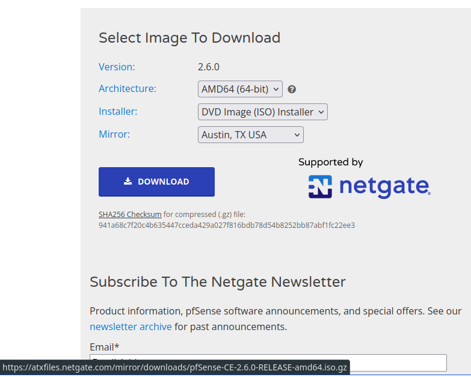
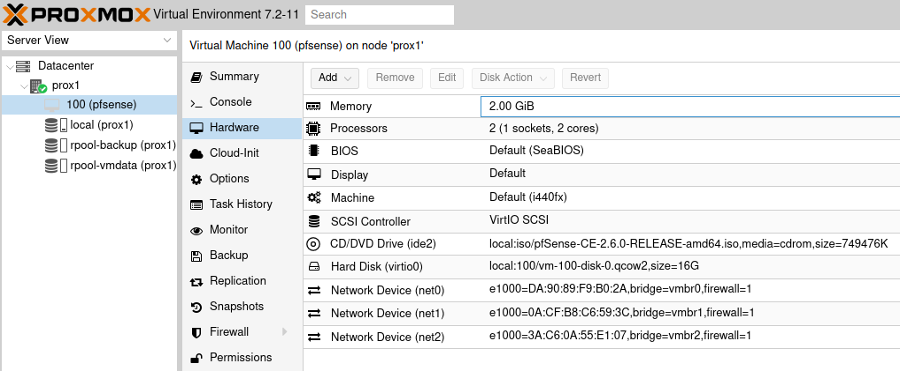
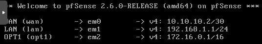

<p align="center">
	<a href="https://www.hetzner.com/"></a>
    <br>
	<a href="https://www.proxmox.com"></a>
    <br>
	<a href="https://www.pfsense.org/"></a>

</p>

# Project Goal
This project shall help everyone who is seeking a good solution and guideline to setup Proxmox into a Hetzner root or bare metal server. Also, a setup with pfSense/OPNsense will be described. All settings will be done with a focus to security and to have a solid solution.
In the world wide web existing many solutions and guidelines, but they are most outdated.

<p align="center">
	<a href="https://www.buymeacoffee.com/3xpl0ith4cr" target="_blank"></a>
</p>

## Scope
### Hetzner
- Part 1 - Setup from the scratch and setup through rescue mode
- Part 2 - Setup proxmox with help of scripts from <a href="https://github.com/CasCas2/proxmox-hetzner">https://github.com/CasCas2/proxmox-hetzner</a>
- Part 3 - Secure your base Proxmox setup
- Part 4 - Network Interface configuration for 1 IP address and IPv4

### Proxmox
- 
- 
- 

### pfSense
- 
- 


---
#Let's start
# Hetzner setup
### Part 1
Log in into your Hetzner account and switch over to the **robot**


Goto the chapter **server**


and select your server. Afterwards you can go directly to your rescue tab.


Select Linux as the Operating System and click on **Activate rescue system**
For further details of the capabilities of the Hetzner Robot and Rescue System please follow the documentation from Hetzner. [https://docs.hetzner.com/robot](https://docs.hetzner.com/robot)

**Please use for all passwords an password manager**

After the activation of the rescue system you have 60 minutes to reboot your server.
Before you do this safe the shown credentials into your password manager.
E.g.: [https://vault.bitwarden.com/#/login](https://vault.bitwarden.com/#/login) or self-hosted alternative [https://github.com/vineethmn/vaultwarden-docker-compose](https://github.com/vineethmn/vaultwarden-docker-compose)
You will receive the username **root** and the new **password** only working for the rescue system.

Switch to the tab **Reset** and select the **Execute an automatic hardware reset**

#### Alternative if you have already access to your server via SSH you can normal reboot your server
`shutdown -r now`

Start directly after you log off of your ssh session with a ping to your public IP address.

If you doesn't had a ssh connection just start an ping.

Use an terminal to logon with your ssh credentials.

If you receive an identification change, than you had a previous connection to your server and you must get rid of the existing fingerprint.
`ssh-keygen -f "/home/<user path>/.ssh/known_hosts" -R "xxx.xxx.xxx.xxx"`

Afterwards you can access normally and accept the new ECDSA key fingerprint of your server.
You should see an standard welcome screen from Hetzner with some basic informations.


---

### Part 2 - Installation of Proxmox using predefined scripts and the rescue system
Please use the repository of CasCas2 and the very well created scripts for the proxmox installation.
[https://github.com/CasCas2/proxmox-hetzner](https://github.com/CasCas2/proxmox-hetzner)
forked from [https://github.com/extremeshok/xshok-proxmox](https://github.com/extremeshok/xshok-proxmox)

```
git clone https://github.com/CasCas2/proxmox-hetzner.git
cd proxmox-hetzner/
ls -lah
chmod +x *.sh
ls -lah
```

after these commands you will se the content of the scripts and they are all executable.
This is a standard procedure. It is absolutely enough to make only the **install-hetzner*.sh** executable.

**Please check the scope of the script before you use it. Learn it what stuff is done inside the scripts!**

With ```./install-hetzner-nvme.sh prox2```i will start my installation. This is based on the standard welcome screen and the ordered hard drives or NVME storage inside the server.
**You can also use an FQDN for your server if you now it already**

The script is installing proxmox with the same tools Hetzner gives you ```InstallImage```
But afterwards some Bugfixes and security setups are also running. So really, please check the scripts.

This will take some time. So get a coffee or two. up to the perfromance of your server it will last round about 5 - 10 minutes.

At the end you will see an **Installation complete** and that you can reboot.
`shutdown -r now` will help. But keep in mind that after the reboot an other ECDSA key fingerprint will be set.
So please use the time of the reboot and remove the fingerprint of the rescue system.
`ssh-keygen -f "/home/<user path>/.ssh/known_hosts" -R "xxx.xxx.xxx.xxx"`

Let a ping run. After the system is reachable you can connect with your root account and the same credentials as the rescue system has give you.

If everything has worked so far, you will see the default ssh response with your hostname.


We check if proxmox is running properly with `netstat - tunlp`
We're searching for the port **22** (SSH) and **8006** (GUI from Proxmox Proxy)


I prefer to use the ZFS solutions. In my case i use after the installation the script `wget https://raw.githubusercontent.com/CasCas2/xshok-proxmox/master/lvm-2-zfs.sh -c -O lvm-2-zfs.sh && chmod +x lvm-2-zfs.sh
./lvm-2-zfs.sh`

Please go to Part 3.


### Part 2 (alternative way) - Installation with standard Hetzner Installimage Script and selection of Proxmox
- [ ] ToDo: Describe or link the default InstallImage way
### Part 2 (pure alternative way) - Installation of blank Debian 11 and installation of Proxmox from APT
- [ ] ToDo: Describe or Link the default Hetzner way
- [ ] ToDo: Describe or Link the default Debian 11 with APT way

---

### Part 3 - Secure your fresh Proxmox Server
Based on the good post of TechnoTim and his "*Before I do anything on Linux, I do these 13 things*"
[https://docs.technotim.live/posts/fist-13-things-linux/](https://docs.technotim.live/posts/fist-13-things-linux/) - *current update from Aug 4, 2023*

**But** based on the script the system is pure and many times updated.
Also, from my perspective I don't like to have a productive system with unattended-upgrades. For this a like to setup solutions with Ansible.
- [ ] Describe and Link to Ansible Docker solution

#### Account
##### Add user 
It is very important to setup a separate user account and not use root for all stuff.
In this guide i will use **user** as the username.
`adduser user` - please replace *user* with your username you want to have.

##### add to sudoer
`usermod -aG sudo user`

##### SSH Server
[https://linuxhint.com/use-ssh-copy-id-command/](https://linuxhint.com/use-ssh-copy-id-command/)

[https://phoenixnap.com/kb/linux-ssh-security](https://phoenixnap.com/kb/linux-ssh-security)

The target now is to copy sour ssh credentials to your server and switch to key based authentification.
Please remember that this client you are working will be the only one whith access to the server.
Before we start check if ssh is properly installed on your local system.
Execute`ssh` and `ssh-copy-id` without any parameter to check if this tools are installed.

Build your ssh-keygen with `ssh-keygen`
If you wish that only one client shall be possible to access the server via ssh than keep the filename as it is.
If not than change it to the client name. In my case **mx_client_id_rsa**
After the keygen is done you will find two files. Please be sure you don't give your private key outside of your hands. For this we use the `ssh-copy-id` tool.

`ssh-copy-id -i ~/.ssh/mx_client_id_rsa.pub user@xxx.xxx.xxx.xxx`

Please check directly afterwards with a new terminal that the credentials are working and you can connect to the server.

If you use Windows for administration of your server than please use Git for Windows [https://gitforwindows.org/](https://gitforwindows.org/)
Included in the git bash you will find `ssh-copy-id`

Check with `cat .ssh/authorized_keys` that only **one** key is available.
If you add further key's, please check after copy that only the among you want are available.

Execute `nano /etc/ssh/sshd_config`and **add** the following parts.
```
ChallengeResponseAuthentication no
```

Please **change** in the same file the following parts.
Change the `#PasswordAuthentication yes` to `PasswordAuthentication no`
Change the `Port 22` to some other number `Port 2222` or `Port 22222` or anything you want.
Change the `PermitRootLogin yes` to `PermitRootLogin no`. Afterwards no login for root via ssh is possible.

Open a new ssh connection with your user account. **If you renamed the file be sure to use the -i parameter.**
With the user account you can execute `sudo service ssh restart`.
Logout from the user account and re-login. If this works, please close your root ssh connection and try to re-login.
You should receive these message.

This is a good point. Standard port will be refused and if you know the right port you need the correct publickey **and** the correct password of the key.

If you get lost and locked yourself out, go to the starting point and beginn from the Rescue Image. Keep in mind all changes here lead to a non-standard setup which increase your security but also reduce your comfort. **Keep this in mind!**

For the further steps, please log in via ssh into your user account.

#### Port knocking
If you want further hardening for your server you can implement port knocking.
[https://www.howtogeek.com/442733/how-to-use-port-knocking-on-linux-and-why-you-shouldnt/](https://www.howtogeek.com/442733/how-to-use-port-knocking-on-linux-and-why-you-shouldnt/)

You can think about port knocking like it was in the 1920 prohibition time. You had access only if you know how to knock a specific door. *"Funny time"*
The same principle you can setup to your server. The articel from How-to Geek is very good and also explains in a good manner why you shouldn't use it.
To have a extreme variant of differnt ports you *knock knock* in sequence and after the correct sequence the hidden known port will be opened is really cool.
But if the daemon in the background is not working, your port will never be available.
My recommendation. If you want have such a secure configuration you need a second way of access to the server.
A fixed VNC connection to an jumphost (iptables) inside the LAN network. Only reachable through a VPN connection. In this case a port knocking from the WAN direction is possible!


#### Time zone
To check logs and further details in the future we need to set the time zone accordingly. If you are living without any local consideration, please keep thhe default set to UTC.

You can check the time zone with `timedatectl`
You will se something like this


My opinion would be to use the dpkg to set the time zone. But you can use whatever way you want.
`sudo dpkg-reconfigure tzdata`

#### NTP time
The NTP time will be setup within proxmox and an separate NTP container.
If you have already an NTP server in your network so please setup inside the **timesyncd.conf**

`sudo nano /etc/systemd/timesyncd.conf`
Insert the IP address of your NTP server
NTP=xxx.xxx.xxx.xxx

Optional keep or insert another fallback NTP server.

Afterwards restart the service.
`sudo timedatectl set-ntp off`
`sudo timedatectl set-ntp on`

#### Fail2Ban
Fail2Ban are already installed witin the script during the installation process.
Let's check the status.
`sudo fail2ban-client status`

If you see this, everything is fine.


Now let's check the explicit status of the sshd
`sudo fail2ban-client status sshd`


My recommendation would also to increase the bantime and further parameter.

`sudo nano /etc/fail2ban/jail.conf`

bantime.increment = true -> uncomment this line
bantime.multiplier =  1 3 6 18 36 72 144 -> uncomment this line and change the values
findtime = 10m -> change this value which fit's to you
bantime = 10m -> change this value which fit's to you

###### findtime
findtime defines the time to find an host which acts malicious.
If you reduce the value and a host is try to access your system only 4 time in 9 minutes, fail2ban will not detect the host.
If you increase the value more hosts will could be detected. If you increase it like hell for "days" your db will increase and slow down your system.
Change with care and monitor the performance. **To less is also not good as to much!**

###### bantime
With a bantime of 10m == 10 minutes an potential attacker will be banned for *"only"* 10 minutes. After this time, the attacker/script kidie or bot will go forward.
In my opinion is someone try to access my system this host should be banned for a long long time. My recommendation is to increase the bantime. But which time is long enough?
**Solution is the bantime.multiplier**
With the multiplier the bantime increases longer and longer everytime fail2ban detects the same host. In our setup will it act with this solution:

- First try --> host will be banned for 10m x 1 = 10 minutes
- Second try --> host will be banned for 10m x 3 = 30 minutes
- Third try --> host will be banned for 10m x 6 = 60 minutes
- Fourth try --> host will be banned for 10m x 18 = 3 hours
- Fifth try --> host will be banned for 10m x 36 = 6 hours
- Sixth try --> host will be banned for 10m x 72 = 12 hours
- Seventh try --> host will be banned for 10m x 144 = 24 hours

Safe the changes and restart the service.
`sudo service fail2ban restart`

Check that the service is running 
`sudo systemctl status fail2ban`

Let's check the sshd again
`sudo fail2ban-client status sshd`

Now it will be time to restart the server.
`sudo shutdowm -r now`

Start directly a ping to the address and wait for response and log in again.

Check direclty with `sudo cat /var/log/fail2ban.log` the configuration.


### - LVS to ZFS script
`mkdir Downloads`

`cd Downloads`

`sudo apt update`

`sudo apt install git`

`git clone https://github.com/CasCas2/proxmox-hetzner.git`

`cd proxmox-hetzner`
Make all shell scripty executable with `chmod +x *.sh`

execute `sudo ./lvm-2-zfs.sh`

If you see at the end this kind of pool configuration you have changed your LVM structure into and ZFS structure.
Please inform yourself about the positive effects of ZFS.
Don't forget to restart the server as mentioned.


After restart check again the Pool status.
`sudo zpool status`

#### Last step to finalize the proxmox setup, please execute the script install-post.sh

For all further actions, we will change to the GUI.
Therefore, please check your IP address given by Hetzner and access to the port 8006.
`https://xxx.xxx.xxx.xxx:8006`

In the beginning you will receive a warning.


Go forward an click the advanced button and Accept the risk and continue.
As we know this is our server, we know what we are doing.


During each time you will be forwarded to the login.
Please input your credentials from the setup.
Hopefully you have used a password manager.
For the first time we will login via root account.

#####Deactivate the no subscription warning
`cd /usr/share/pve-manager/js`
`sudo cp pvemanagerlib.js pvemanagerlib.js.bkp`


`sudo nano pvemanager.js`

- [ ] ToDo: Check if the comment change is necessary.

With nano use ctrl+w for search and search for "No valid subscription"
You will find h1 definition
Search further for "invalidHtml"
Comment the line with "me.update(me.invalidHtml)" with two backslash -> //


Some lines below you will find the function of initComponent.
Within this function you will find a check of data.status and if it is active.


Change the **===** into **!==**
This will change the question from is the data status active to is the data status **not** active. And this will be everytime the truth.

Write the content to the file with ctrl+o and close the file with ctrl+x
Restart the pveproxy service
`sudo systemctl restart pveproxy.service`

Check the status of the pveproxy.service
`sudo systemctl status pveproxy.service`

If the service is running again, everything has worked. If not, replace the backup file with the current pvemaangerlib.js file.

Switch to the GUI, logout, refresh your browser and login again.
The subscription message will not show.

Crosscheck the change and go to the current server in the chapter *Subscription*
You should find the **Status** with *notfound: There is no subscription key*
Click on check and you will recognize nothing changed.
Everyone is happy.

Switch back to your download folder with the install-post.sh script and execute it.
`sudo ./install-post.sh`

This will finalize some topics for an un-interrupted working with Proxmox.
Don't forget to restart the server as mentioned.


For the first time go to *Summary* and check the status.

You will find a fresh, good and stable running system.


- [ ] ToDo: Accept the warning for the first, install PfSense and an jumphost. 
- [ ] ToDo: Block every access to the WebGUI from the WAN direction with firewall rules and NGINX as an reverse proxy


*For the first, get focused for the SSL warning.*

*#### - Setup letsencrypt for a proper SSL encyrption for the WebGUI*


#### Setup network configuration for PfSense
Based on the setup scripts the basic network interface configuration is available.
This we will extend directly from the terminal level.
Login into your server via SSH.

`sudo nano /etc/network/interfaces`

We will first extend the iface for inet based on ipV4.

```
post-up sysctl -w net.ipv4.ip_forward=1
post-up iptables -t nat -A PREROUTING -i enp0s31f6 -p tcp -m multiport ! --dport 22,8006 -j DNAT --to 10.10.10.2
post-up iptables -t nat -A PREROUTING -i enp0s31f6 -p udp -j DNAT --to 10.10.10.2
post-up sysctl -w net.ipv6.conf.all.forwarding=1
# WAN Proxmox
```
**IMPORTANT: change the SSH port to your setting.**
**IMPORTANT: change the interface name to your iface name** ``-i enp0s31f6``

The existing comment for route from your ip via the gateway is already implemented in the above lines. This comment is only to be shown in the proxmox WebGUI. But we need another comment. You can remove it.

This lines will create pre-routing settings for TCP and UDP to forward directly to PfSense, expected SSH and the WebGUI port 8006.

Please insert these line after your last perconfigured iface.

```
auto vmbr0
iface vmbr0 inet static
	address 10.10.10.1/30
	bridge-ports none
	bridge-stp off
	bridge-fd 0
	post-up iptables -t nat -A POSTROUTING -s '10.10.10.2/30' -o enp0s31f6 -j MASQUERADE
	post-down iptables -t nat -D POSTROUTING -s '10.10.10.2/30' -o enp0s31f6 -j MASQUERADE
# WAN pfSense - LAN Proxmox

auto vmbr1
iface vmbr1 inet static
	address 192.168.1.1/24
	bridge-ports none
	bridge-stp off
	bridge-fd 0
# LAN pfSense

auto vmbr2
iface vmbr2 inet static
	address 172.16.0.1/16
	bridge-ports none
	bridge-stp off
	bridge-fd 0
# DMZ pfSense
```
**IMPORTANT: change the interface name to your iface name** ``-i enp0s31f6``

Description of the changes.

The VMBR0 is a Virtual Machine Bridge which create a minimal network communicating only between proxmox and pfsense and will act as the WAN interface from the PfSense/OPNsense perspective. With the subnet of /30 only two devices can operate.
In this case only 10.10.10.1 (proxmox) and 10.10.10.2 (pfsense) can talk to each other.
Based on the pre-routing all communication will be forwarded directly and only to the PfSense/OPNsense.

The VMBR1 will act as the connection for LAN network for PfSense/OPNsense
The VMBR2 will act as the DMZ connection for PfSense/OPNsense

That's all for now. Save and exit.

Restart your server.
`sudo shutdown -r now`


Refresh the network section in the Proxmox WebGui.


At the end you should have a similar setup.
The comments recognize clearly what network will be used for what.


#### Download and setup PfSense or OPNsense
Login into your server via SSH.
`cd /var/lib/vz/template/iso`

Navigate with your browser to this URL
[https://snapshots.netgate.com/amd64/pfSense_master/installer/](https://snapshots.netgate.com/amd64/pfSense_master/installer/)

Here you will find every image as a nearly daily build.
Search for the latest stable version.
Hover the download button and copy the link.


Go to your terminal and enter
`sudo wget https://atxfiles.netgate.com/mirror/downloads/pfSense-CE-2.6.0-RELEASE-amd64.iso.gz`
*The link changes based on the latest stable version*

Also, download the SHA256 Checksum file

`sudo wget https://www.pfsense.org/hashes/pfSense-CE-2.6.0-RELEASE-amd64.iso.gz.sha256`

In the end you should have the *.iso.gz and the *.sha256 file.

Let's check the sha256 checksum
`sha256sum -c pfSense######.iso.gz.sha256`

If the result is ok this means that the archive from the website of PfSense was downloaded into your server without any changes. 

In this case you can be happy, because in this file no MITM - Man-In-The-Middle was compromising your file.

Let's unzip the ISO file.
`sudo gzip -d pfSense-CE-2.6.0-RELEASE-amd64.iso.gz`

This should be the result


You can remove the sha256 file
`sudo rm pfSense########.gz.sha256`

Back on the WebGUI go to the server -> local storage -> ISO images


Let's create our first virtual machine.
Click on **Create VM**

As we are professionals, we use everytime the advanced options.
Activate the Advanced checkbox.

VM ID will be suggested as 100. I recommend separate it to your machines and container.
My recommendation is to use from 100 container and beginning of 200 virtual machines.
But you can also mix them and separate with the ID your networks.
100 will be common machines.200 could be WAN side, 300 could be the DMZ and 400 will be the LAN side.
How you wanna do it, do it with your comfort and usability.

In my understanding will PfSense between all zones. I will use VM ID 100 to have PfSense abslutely on top of my machines.

Based on the importance of this machine, activate start on boot.
Select a proper name. The name will be also directly the machine name and will be found in the DNS area.


In the next seciton we shall select an ISO image. Thank god we have downloaded it before.


You can keep the system section as it is.


Have at least 2 cores and 2048 MB for memory.

Change the network model to Intel E 1000

Confirm the settings, but don't start directly after created.
We need add the two network connections.

After the creation, go to the VM into hardware and add two network devices also with the model of Intel E1000


Now, start your first virtual machine. So exiting.
If everything is working like it should you will see in the summary a perfect running virtual machine.


Let's go forward.
Click on console to open a new window with the terminal view of the PfSense VM.

- First accept the copyright and distribution notice.
- Select Install pfSense
- Find your keymap
- Partitioning use Auto (ZFS)
- Install the system
- stripe - No redundancy
- ZFS configuration, select vtbd0
- And accept to setup the disk
- Now pfSense will installed into the virtual machine
- Manual configuration. If you have the need to manually change something, feel free. Otherwise select no to open a shell.
- Reboot into the installed system. Keep the window open
- Wait until pfSense has booted up


Now we will first assign the interfaces. So please select option 1.

- VLAN. If you have an direct need, feel free. 
- WAN -> em0
- LAN -> em1
- OPT1 -> em2
- Proceed: y

Now we set the interface IP addresses. So please select option 2.

- 1 for WAN interface
- DHCP in WAN. Hell no. -> n
- Enter new WAN IPv4 address. -> 10.10.10.2
- Subnet 24
- WAN gateway will be proxmox. enter 10.10.10.1
- IPv6 via DHCP. Hell no again.
- For normal cases an IPv6 address is not necessary. But feel free to setup it. Otherwise press enter for none
- Revert HTTP as WebConfigurator protocl -> n

Let's move forward for LAN settings. Option 2 with interface 2.

- 192.168.1.1
- Subnet 24
- Gateway. for LAN press enter for none
- DHCP we want for LAN -> y
- Start address for IPv4 clients: 192.168.1.100
- End address for IPv4 clients: 192.168.1.200
- Revert HTTP as WebConfigurator protocl -> y

Let's move forward for OPT1 settings. Option 2 with interface 3.

- 172.16.0.1
- Subnet 16
- Gateway. Also none, press enter
- DHCP server. My recommendation is to have it disabled and work inside your DMZ with fixed IP address



Clsoe the QEMU browser window.

Now is the basic setup of pfsense done. Webconfiguratior access will be through the LAN network.
For this we will as the next steps setup a further VM with GUI inside the LAN network to step into the easier configuration possiblities.

For this we need setup a virtual machine inside the LAN network which is not headless.
Please download any system you wanna install. In this case i decide to install LUbuntu.

Based on Proxmox capabilities you can directly download thorugh the WebGUI.
Got via the local storage, to the ISO folder and select **Download from URL**.

[https://lubuntu.me/downloads/](https://lubuntu.me/downloads/)

Based on some webpages for download ISO's you will ether a link or an download button.
If you find a download button you can right click on it and copy the link.

With this you can paste it into the URL field and query the URL. In the most cases it will suceed. If not, please check the link you given.

Afterwards don't forget to use the checksum and to verify it. We want use only secure systems.


####Setup first virtual machine in LAN network

Like the setup of the proxmox virtual machine we will install LUbuntu to use it inside the LAN network for further setup of the pfSense.


After the VM start we will use the proxmox capabilities of the console to have access for an GUI guided installation.

Some remarks:

- the system will have no access to the internet. Any updates will not work.
- you can setup like you want. This VM is will be only used for pfSense setup until the DMZ is created and useable for kinds of jump hosts or access via VPN is created.

After sucessful installation we will access the pfsense via the available browser.


The default credentials are **admin** and **pfsense**
Based on many guidelines how to setup pfSense I will recommend you this source:
[https://nguvu.org/pfsense/pfsense-baseline-setup/](https://nguvu.org/pfsense/pfsense-baseline-setup/)


- [ ] ToDo: hier geht es weiter


### - 

### ToDo: Need to check
[https://docs.technotim.live/posts/crowdsec-traefik/](https://docs.technotim.live/posts/crowdsec-traefik/)
[https://www.crowdsec.net/](https://www.crowdsec.net/)
[https://www.youtube.com/watch?v=Cs8yOmTJNYQ](https://www.youtube.com/watch?v=Cs8yOmTJNYQ) - Techno Tim Self-hosting security Guide for your homelab
- Check Techno Tim Website for further tips and tricks
- 

---


# References
https://phoenixnap.com/kb/linux-ssh-security
https://github.com/CasCas2/proxmox-hetzner
https://schroederdennis.de/allgemein/proxmox-auf-rootserver-mit-nur-1-public-ip-addresse-pfsense-nat/
https://forum.proxmox.com/threads/hetzner-host-with-pfsense-and-additional-ipv4-address-slow-internet.74306/

https://www.youtube.com/playlist?list=PLNmsVeXQZj7oAAFVjNrAz1uRqIcanXreg
https://www.youtube.com/playlist?list=PLcxL7iznHgfXoNOuBqzzni4p_PgM_s71f
https://www.youtube.com/playlist?list=PLcxL7iznHgfVclnHZfar05VJ7IdsY4yx_
https://www.youtube.com/playlist?list=PLcxL7iznHgfVLL50jvHM43ZV4ru8N5Vab

https://forum.proxmox.com/threads/hetzner-proxmox-pfsense.54068/

https://docs.technotim.live/posts/fist-13-things-linux/
https://docs.technotim.live/posts/first-11-things-proxmox/


